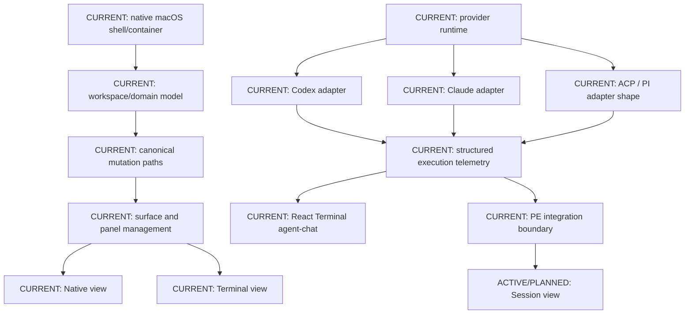
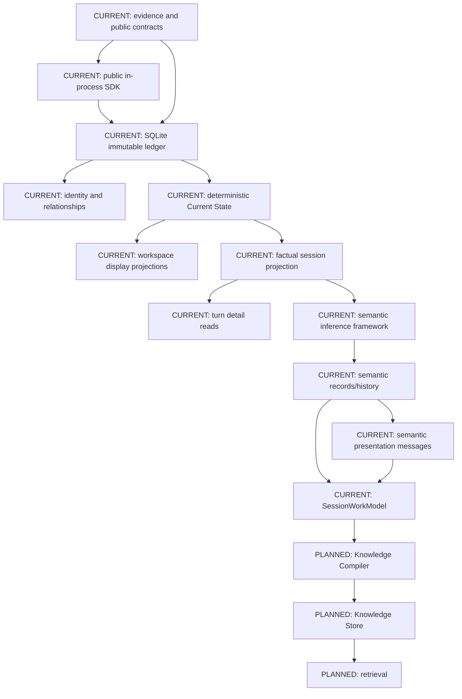

# Component Map

This map describes major components and their maturity. It intentionally avoids
one giant graph; use [data-flows.md](data-flows.md) for flow-specific diagrams
and [implementation-map.md](implementation-map.md) for file locations.

## bmux Components

CURRENT bmux implementation includes the native app shell, workspace/session
models, panel/surface hosting, provider sessions, `agent-chat` React Terminal,
provider-normalized execution telemetry, PE evidence production, and workspace
Current State consumption.

The Session view should remain a separate summary/understanding surface. It must
not become a second transcript and must not infer PE-owned semantics in React or
Swift presentation code.

## Provenance Engine Components

PE's implemented semantic layer records inferred meaning and separately
materializes human-readable messages. `SessionWorkModel` should
compose factual projections, semantic records, semantic messages, and provenance
references into a stable consumer snapshot.

## Boundary Rules

- bmux imports `ProvenanceEngineContracts` and `ProvenanceEngineSDK`.
- bmux does not import `ProvenanceEngineSQLite` in production integration paths.
- PE does not import bmux app, UI, provider, terminal, or workspace internals.
- PE package tests may exercise SQLite internals; external consumers should use
  contracts and SDK.
- Shared Project Truth status lives at repository root, not inside PE or a peer
  checkout.
