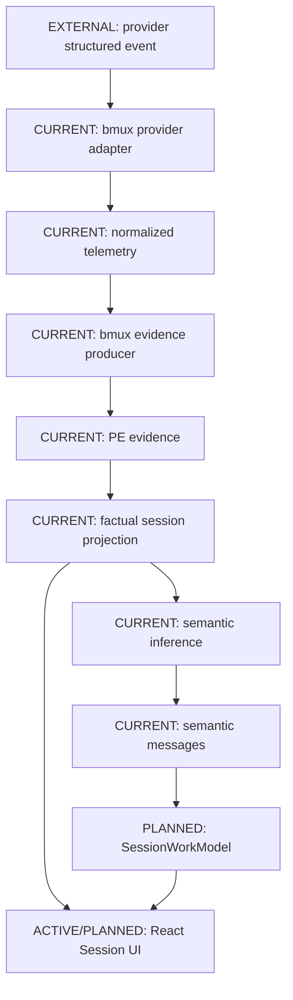
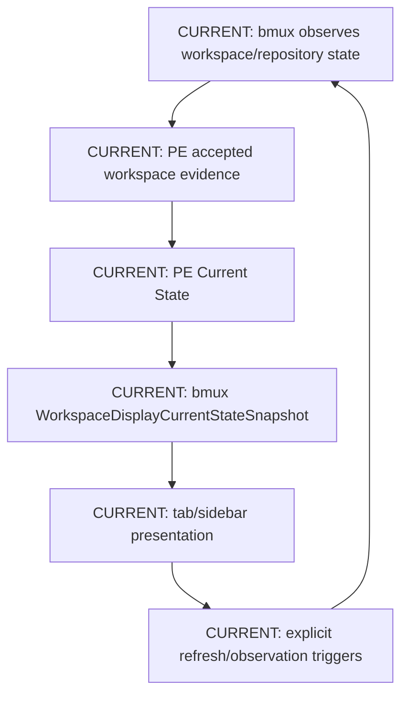
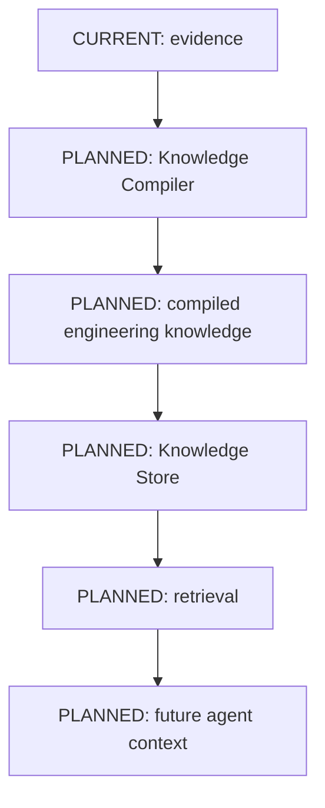

# Data Flows

## Coding-Agent Session Flow



Evidence is what was accepted as observed. Factual projection is a deterministic,
rebuildable organization of those facts. Semantic inference is what those facts
appear to mean. Semantic messages are human-readable wording for that meaning.
A wrong inference and poor wording are different defect classes.

## Workspace Context Flow



bmux owns observation and presentation. PE owns accepted evidence and deterministic
Current State. Missing observations do not clear known state; explicit clear
evidence is required.

## Knowledge Flow Target



Session understanding explains active work. The Knowledge Compiler creates
durable engineering knowledge intended to survive the session and support later
retrieval. These are related, but not the same layer.

## Project Truth Flow

```mermaid
flowchart TD
  graph["CURRENT: canonical Project Truth\nproject/project-state.yaml + repo-status.yaml"] --> validate["CURRENT: validation and dependency readiness"]
  validate --> execution["CURRENT: execution state and active worktree checks"]
  execution --> generated["CURRENT: generated roadmap/status docs"]
  generated --> agents["CURRENT: agent planning and developer understanding"]
  generated --> ci["CURRENT: read-only CI gate"]
```

Dependency-ready, selected-next, active, and dependency-ready-but-not-selected
remain distinct. Readiness is derived from dependency state. Selection is an
execution decision, not a mutable readiness flag.

