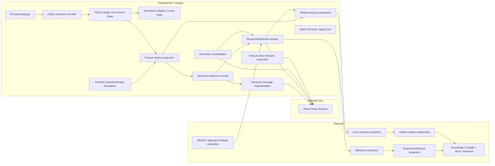

# Architecture Progress

This page is a human-readable progress map. Generated Project Truth remains the
authority for exact status.

## Completed Migration Impact

The monorepo migration simplifies future cross-component slices so a single
branch, worktree, and PR can update PE contracts and bmux consumers together.
It does not make PE a bmux-internal module.

## Next Dependency-Ready Product Direction

After the completed monorepo and factual native Session view slices, the next
product slices should resume in this order unless Project Truth changes:

1. Build richer cross-session work-state semantics from validated
   `SessionWorkModel` and related-session foundations.
2. Add artifact and change collision awareness from factual overlap evidence.
3. Add agent-accessible explicit cross-session retrieval.
4. Continue React Smart Session work from PE factual projection, semantic
   messages, and `SessionWorkModel` without local semantic reinterpretation.
