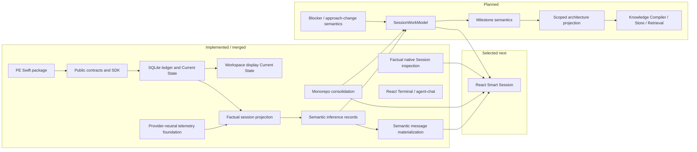

# Architecture Progress

This page is a human-readable progress map. Generated Project Truth remains the
authority for exact status.

## Completed Migration Impact

The monorepo migration simplifies future cross-component slices so a single
branch, worktree, and PR can update PE contracts and bmux consumers together.
It does not make PE a bmux-internal module.

## Next Dependency-Ready Product Direction

After the completed monorepo and factual native Session view slices, the next
product slices should resume in this order unless Project Truth changes:

1. Build React Smart Session foundation from PE factual projection and semantic messages.
2. Define the PE-owned `SessionWorkModel` contract.
3. Add milestone, blocker, approach-change, and scoped architecture semantics.
4. Connect React Smart Session to `SessionWorkModel` once the contract exists.
