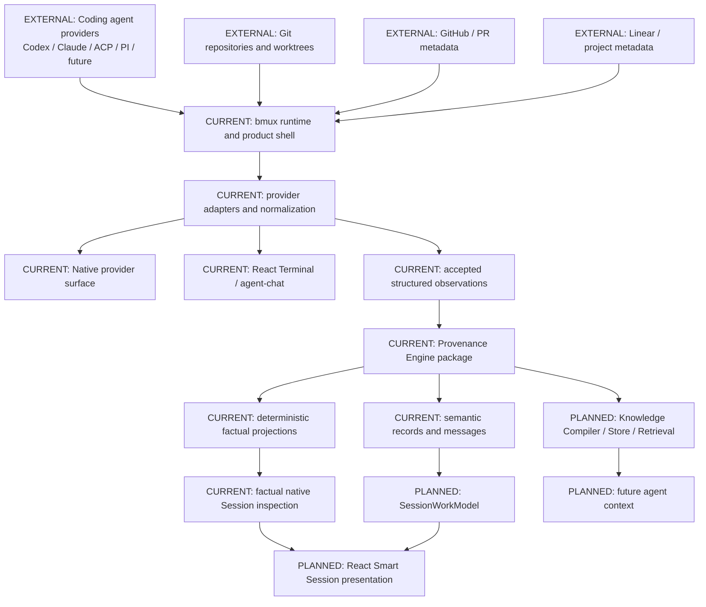

# System Overview

bmux is now the canonical repository for one product architecture with multiple
strong component boundaries. Provenance Engine is a first-class package inside
that architecture, not a bmux implementation detail.

## Current Repository Shape

```text
bmux/
  apps and product runtime: root app sources, web, agent-chat, webviews
  Packages/macOS/ProvenanceEngine/: independent PE Swift package
  Packages/Shared/, Packages/iOS/, Packages/macOS/: other package groups
  project/: canonical Project Truth graph and repo status
  tools/project-docs/: Project Truth validation and generation
  docs/: authored architecture, product, planning, decisions, generated status
  .github/: monorepo CI
```

The imported PE package still owns its SwiftPM package metadata, public products,
contracts, SDK, storage implementation, tests, docs, and future extraction path.

## Level 1 Product Map



## Current Responsibilities

bmux owns live interaction, local runtime behavior, provider acquisition,
provider-specific adapters, session lifecycle, terminal/native/web surfaces,
capture policy, optimistic presentation, UI routing, and user-facing fallbacks.

Provenance Engine owns accepted evidence contracts, local durable storage,
rebuildable factual projections, semantic inference contracts and records,
semantic messages, `SessionWorkModel`, Knowledge Compiler,
Knowledge Store, and retrieval layers.

The dependency direction is intentionally one-way:

```text
bmux runtime/UI -> PE public contracts and SDK -> PE storage/projection internals
```

PE must not import bmux app, UI, terminal, runtime, or provider-adapter internals.

## Current Versus Target

CURRENT:

- bmux can consume PE from the local monorepo package path.
- PE is a standalone SwiftPM package under `Packages/macOS/ProvenanceEngine`.
- Project Truth is root-local under `project/`.
- The Project Truth workflow validates one canonical graph without peer checkout.
- PE has implemented factual session projection, semantic inference framework,
  first coding-agent semantic records, human-readable semantic messages,
  SessionWorkModel projection, and a first plan/prompt-backed milestone
  semantic field.
- bmux has React Terminal foundations in `agent-chat` and native/workspace PE
  consumers, including the factual native Session inspection view.

SELECTED NEXT:

- Use generated Project Truth for the current selected-next and active work.
  React Smart Session work should consume PE facts, semantic messages, and
  SessionWorkModel fields rather than infer semantic meaning inside bmux.

PLANNED:

- React Smart Session surface backed by PE facts and semantics.
- Nested milestone, blocker, approach-change, and scoped architecture semantics.
- Knowledge Compiler, durable Knowledge Store, retrieval, and future agent
  context integration.
